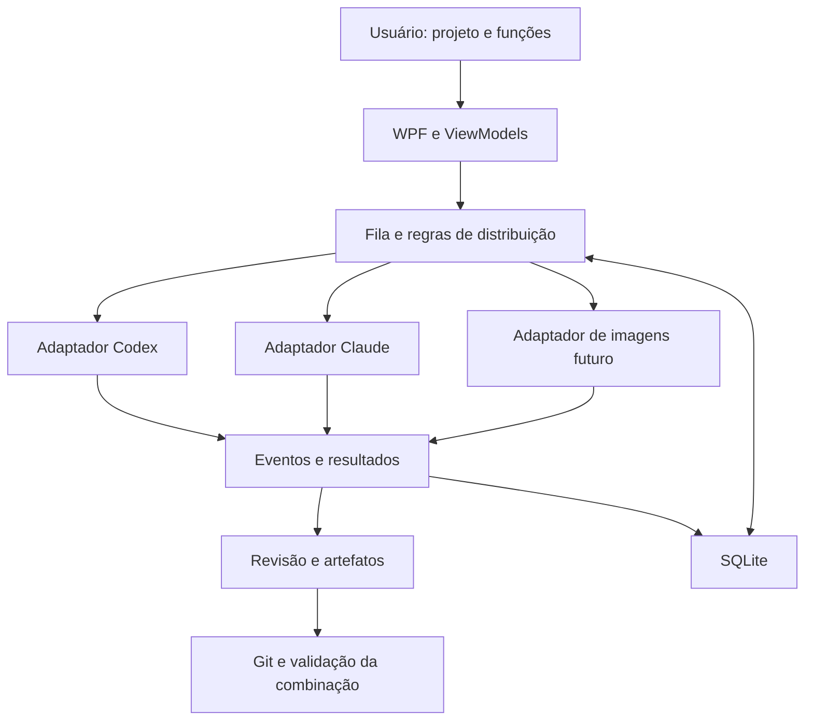

# Arquitetura do Sintonia

## Stack e organização

C# com .NET 10, interface WPF em MVVM e SQLite para o histórico real. A primeira versão é local e focada no Windows.

Estrutura atual (M0 e adaptadores reais do M1):

```text
Sintonia.sln
src/
  Sintonia.Core/           Modelos, estados, dependências e contratos
  Sintonia.Infrastructure/ Adaptadores simulados/reais e processos
  Sintonia.Desktop/        WPF, ViewModels, navegação e composição
tests/
  Sintonia.Core.Tests/     Regras do núcleo
  Sintonia.Desktop.SmokeTests/  Fluxo real WPF com provedores simulados
  Sintonia.Infrastructure.Tests/  Detecção e ciclo de vida de processos
  Sintonia.ProcessFixture/  Processo auxiliar, sem modelos
tools/
  Sintonia.Diagnostics/   Consulta limitada de versão e ajuda
docs/
```

O Core não depende de WPF ou dos executáveis dos provedores. Infrastructure implementa contratos do Core. Desktop apresenta dados e compõe os serviços; não executa regras de negócio dentro de eventos visuais. Começar com apenas os projetos necessários ao incremento.

No M0, `SchedulingPolicy` decide admissões e valida o grafo; `TaskCoordinator` aplica reservas e transições sob uma trava curta, executando os adaptadores fora dela. Slots cancelados permanecem reservados até a tentativa parar. Snapshots e eventos entregues à UI são cópias de leitura; os ViewModels despacham atualizações para a thread WPF.

`SimulatedProviderAdapter` produz atrasos canceláveis, eventos e texto de exemplo, sem processos ou arquivos externos. `DemoScenario` fornece as quatro funções e cinco tarefas do exemplo. `ProviderSession` é um identificador demonstrativo por tentativa; retomada e compatibilidade com diretórios reais ainda não existem. A aprovação entrega ao dependente o resumo e o identificador da tentativa aprovada; disponibilidade de arquivos/revisões reais será necessária antes de escrita paralela.

O contrato `IProviderAdapter` cobre o fluxo de tarefas do M0. O chat real usa `IConversationProvider`, validado no M1. SQLite e modelos de projetos/conversas já existem; artefatos e integração Git permanecem planejados.

`IConversationProvider` já cobre conversas reais por diretório/modelo/identificador nativo, com eventos e resultado concluído/bloqueado. `ProviderProcess` limita eventos por linha, drena stderr, serializa stdin e encerra a árvore. `JsonRpcClient` correlaciona respostas e processa notificações sem bloquear a leitura. Codex verifica conta ChatGPT e política aplicada antes do turno; Claude verifica `claude.ai`/assinatura e rejeita configuração explícita de API no ambiente. Nenhum adaptador abre arquivos de credenciais. Os dois provedores podem encaminhar autorizações ao host; solicitações sem decisão explícita ou prévia suficiente são recusadas.

`ClaudeStdioSession` usa entrada/saída stream-json e inicialização do protocolo de controle antes do prompt. `can_use_tool` recebe resposta correlacionada por ID, com os mesmos parâmetros (`updatedInput`) e sem mudanças de regras (`updatedPermissions`). O host mostra o objeto completo até 64 mil caracteres; leitura, entradas ausentes/excessivas e interações especiais são recusadas. Decisões são assíncronas e não bloqueiam stdout; cancelamento do CLI, do usuário ou término inesperado retiram pedidos pendentes. Limites: 16 pedidos simultâneos, 1.024 por turno, 60 segundos para inicializar e cinco minutos por execução. Recusas locais também tornam o resultado bloqueado, mesmo se omitidas no resultado do CLI. O canal permanece aberto até o resultado terminal e as respostas em trânsito terminarem; execução autônoma em background após esse resultado continua sem suporte de acompanhamento.

`SqliteWorkspaceStore` implementa projects/conversations/runs/events/proposals com schema 2, WAL, transações e restrições de integridade. A migração acrescenta proposals ao schema 1 sem substituir seu histórico. A execução assíncrona usa trabalho em background, pois Microsoft.Data.Sqlite realiza I/O síncrono. `WorkspaceChatService` reserva capacidade antes da persistência/inferência, faz checkpoints do identificador/resposta parcial, e registra resultado terminal. Reabrir reconcilia running para interrupted sem reenvio. Escrita no mesmo projeto é serial até existir integração de worktrees.

## Modelo de domínio

| Modelo | Responsabilidade |
| --- | --- |
| Project | Pasta, instruções, repositório e comandos de validação |
| Conversation | Chat do Sintonia vinculado ao projeto e a sessões nativas identificadas |
| FunctionProfile | Nome, objetivo, provedor padrão e instruções adicionais |
| WorkTask | Entrega, dependências, função, escopo e estado |
| ProviderSession | Provedor, identificador nativo, projeto e diretório compatível |
| TaskRun | Tentativa com início, término, resultado e consumo informado |
| Artifact | Arquivo, diff, imagem ou relatório produzido |
| ApprovalRequest | Ação concreta aguardando uma decisão |

Estados iniciais de tarefa: na fila, executando, em revisão, concluída, falha e cancelada. Interrupção de uma tentativa deve ser identificável. Não usar um booleano único para representar todas essas condições.

## Fluxo principal



## Integrações

O M0 mantém adaptadores simulados. `IConversationProvider` implementa início/retomada, eventos, interrupção e permissões da central real. `ProviderInstallationProbe` consulta detecção/ajuda separadamente e não declara suporte à execução real. Só declarar suporte a uma capacidade depois de verificar o comportamento real. Nem todos os provedores têm os mesmos métodos.

- Codex: App Server por stdio, contratos conferidos contra o schema instalado e autorizações por ação.
- Claude: CLI com stream-json bidirecional, session ID, retomada e host de permissões por ação. Modo plan para leitura e manual para escrita, preservando regras/hooks existentes. AskUserQuestion/ExitPlanMode ainda não têm respostas específicas no host.
- Imagens: adaptador separado, após escolha de provedor.

Usar `System.Diagnostics.Process` com argumentos separados, entrada/saída redirecionada e leitura assíncrona simultânea de stdout e stderr. Resolver wrappers do Windows sem concatenar prompts numa linha de shell. Propagar cancelamento e tratar processos filhos.

Eventos comuns podem incluir sessão iniciada, mensagem, ferramenta, pedido de permissão, consumo, resultado e erro. Preservar dados desconhecidos de forma limitada e segura; não quebrar a sessão apenas porque um provedor adicionou um campo.

## Distribuição e consistência

Começar com duas execuções simultâneas e limites configuráveis por provedor. Dependências só são liberadas quando a entrega necessária foi aprovada e está disponível no diretório/revisão do dependente.

Uma política pura de agendamento decide admissões. A reserva e a criação da tentativa precisam ser aplicadas atomicamente pelo serviço de execução. Proteção contra disparos duplicados, persistência e recuperação entram antes de execução automática prolongada.

Para sessões reutilizadas, conferir provedor, projeto, função e diretório. Conversas não compartilham memória automaticamente: entregar especificações e resumos explícitos entre sessões.

## Persistência, Git e dados

SQLite registra tentativas, estados e eventos com migrações explícitas. Reconciliar execuções interrompidas antes de repetir operações com possíveis efeitos já produzidos.

Worktrees separam alterações. O merge é serial e testado sobre a versão combinada. Uma falha de remoção de worktree não autoriza exclusão recursiva indiscriminada de seu diretório.

Autenticação permanece nos mecanismos suportados dos provedores. Chaves futuras de imagens ficam no armazenamento seguro do Windows, nunca na configuração versionada. Logs devem limitar conteúdo e remover dados sensíveis antes de exportação.

## Interface

Português, com projetos, funções, tarefas, sessões e revisão. Modo demonstrativo precisa estar visível. O estado da execução pertence ao serviço, e não ao controle visual. Evitar bloquear a thread da interface com processos, banco ou Git.

Central para várias pastas de projeto, com chat, escolha de provedor/modelo e navegação de sessões. O histórico local vincula conversas ao identificador nativo, modelo, função e diretório; trocar de provedor cria outra conversa. Abrir a conversa no Sintonia é diferente de abrir/controlar uma janela do aplicativo original; esta segunda capacidade depende de interface verificada.

Essa central está implementada em `WorkspaceWindow`/`WorkspaceViewModel`, com `WorkspaceProject`, `WorkspaceConversation`, `ChatRun` e `ChatEvent`. A função e o acesso podem ser ajustados entre turnos; provedor/modelo são definidos ao criar a conversa e o modelo efetivo é preservado. Jobs vivos mantêm seus ViewModels ao navegar. Códigos de acesso, prompts e eventos nunca são transformados pelo host em comandos de shell. O host apresenta autorizações Codex/Claude via TCS assíncrono e serializa decisões no painel; fechar cancela decisões pendentes. O catálogo do provedor é consultado sob prazo. A demonstração usa `MainWindow` separadamente.

A função de chefe usa uma sessão normal do provedor para produzir uma proposta de tarefas. O aplicativo valida a proposta e aplica as regras; a chefia não ganha um caminho alternativo para alterar permissões, aprovar entregas ou integrar código. Detalhes em [docs/PRODUCT_SCOPE.md](docs/PRODUCT_SCOPE.md).

`PlanProposalFormat` valida a proposta no Core: versão 1, um único bloco sintonia-plan, até 20 tarefas com função, provedor/modelo, acesso recomendado, instruções, escopo, dependências e critérios. Reutiliza `SchedulingPolicy.ValidateGraph`; recusa campos extras/repetidos, enums desconhecidos, dependências inválidas, ciclos e escopo absoluto/com '..'/curingas. A validação é lexical, sem resolver links de diretório e sem constituir sandbox. Nenhuma proposta cria processos ou executa comandos.

`WorkspaceChatService` força leitura e retira o host de autorização quando a função é Chefe do projeto; anexa o contrato do plano somente ao pedido enviado, mantendo instruções originais na conversa. A central importa propostas de respostas concluídas; parsing/persistência de proposta não mudam o resultado já salvo do chat. Abrir revisão reconcilia respostas estruturadas concluídas ainda sem proposta, de forma idempotente, sem inferência ou perda de edições.

`WorkspaceProposal` vincula a definição ao projeto e ao run de origem. Criação lê a resposta concluída no banco e verifica o projeto; um run cria no máximo uma proposta. Edições usam comparação de revision e mantêm origem imutável. Draft/Approved representam revisão do plano; salvar ajustes como Draft retira aprovação. `ProposalReviewWindow`/`ProposalReviewViewModel` oferecem edição, validação, inclusão/remoção e confirmação, sem chamar coordenadores ou provedores. Planos aprovados ainda aguardam execução futura. Detalhes em [docs/PLAN_PROPOSALS.md](docs/PLAN_PROPOSALS.md).

Um terminal completo, editor de código ou renderização avançada de Markdown pode exigir componentes específicos. Só adicionar quando resolver uma necessidade concreta do usuário.
