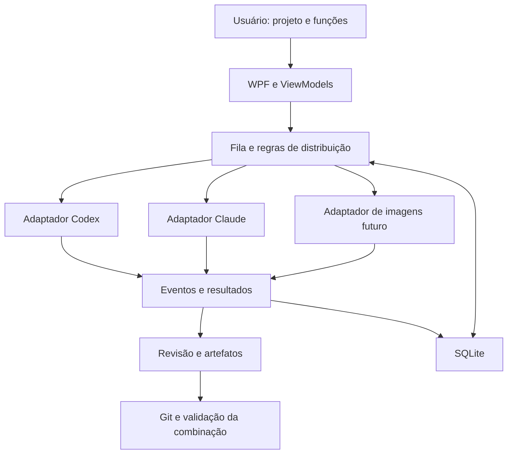

# Arquitetura do Sintonia

## Stack e organização

C# com .NET 10, interface WPF em MVVM e SQLite para o histórico real. A primeira versão é local e focada no Windows.

Estrutura proposta, a ser criada no M0:

```text
Sintonia.sln
src/
  Sintonia.Core/           Modelos, estados, dependências e contratos
  Sintonia.Infrastructure/ Processos, provedores, Git e persistência
  Sintonia.Desktop/        WPF, ViewModels, navegação e composição
tests/
  Sintonia.Core.Tests/     Regras do núcleo
  Sintonia.Infrastructure.Tests/  Eventos e processos quando necessário
docs/
```

O Core não depende de WPF ou dos executáveis dos provedores. Infrastructure implementa contratos do Core. Desktop apresenta dados e compõe os serviços; não executa regras de negócio dentro de eventos visuais. Começar com apenas os projetos necessários ao incremento.

## Modelo de domínio

| Modelo | Responsabilidade |
| --- | --- |
| Project | Pasta, instruções, repositório e comandos de validação |
| FunctionProfile | Nome, objetivo, provedor padrão e instruções adicionais |
| WorkTask | Entrega, dependências, função, escopo e estado |
| ProviderSession | Provedor, identificador nativo, projeto e diretório compatível |
| TaskRun | Tentativa com início, término, resultado e consumo informado |
| Artifact | Arquivo, diff, imagem ou relatório produzido |
| ApprovalRequest | Ação concreta aguardando uma decisão |

Estados iniciais de tarefa: na fila, executando, em revisão, concluída, falha e cancelada. Interrupção de uma tentativa deve ser identificável. Não usar um booleano único para representar todas essas condições.

## Fluxo principal



## Integrações

`IProviderAdapter` representa detecção, início/retomada, eventos, interrupção e permissões. Só declarar suporte a uma capacidade depois de verificar o comportamento real. Nem todos os provedores têm os mesmos métodos.

- Codex: investigar App Server por stdio; gerar ou validar contratos contra a versão instalada. Considerar `exec --json` para lote quando adequado.
- Claude: investigar CLI com saída estruturada, session ID e retomada; definir host de permissões quando necessário. Um SDK por API é uma alternativa futura, com autenticação e termos próprios.
- Imagens: adaptador separado, após escolha de provedor.

Usar `System.Diagnostics.Process` com argumentos separados, entrada/saída redirecionada e leitura assíncrona simultânea de stdout e stderr. Resolver wrappers do Windows sem concatenar prompts numa linha de shell. Propagar cancelamento e tratar processos filhos.

Eventos comuns podem incluir sessão iniciada, mensagem, ferramenta, pedido de permissão, consumo, resultado e erro. Preservar dados desconhecidos de forma limitada e segura; não quebrar a sessão apenas porque um provedor adicionou um campo.

## Distribuição e consistência

Começar com duas execuções simultâneas e limites configuráveis por provedor. Dependências só são liberadas quando a entrega necessária foi aprovada e está disponível no diretório/revisão do dependente.

Uma política pura de agendamento decide admissões. A reserva e a criação da tentativa precisam ser aplicadas atomicamente pelo serviço de execução. Proteção contra disparos duplicados, persistência e recuperação entram antes de execução automática prolongada.

Para sessões reutilizadas, conferir provedor, projeto, função e diretório. Conversas não compartilham memória automaticamente: entregar especificações e resumos explícitos entre sessões.

## Persistência, Git e dados

SQLite registra tentativas, estados e eventos com migrações explícitas. Reconciliar execuções interrompidas antes de repetir operações com possíveis efeitos já produzidos.

Worktrees separam alterações. O merge é serial e testado sobre a versão combinada. Uma falha de remoção de worktree não autoriza exclusão recursiva indiscriminada de seu diretório.

Autenticação permanece nos mecanismos suportados dos provedores. Chaves futuras de imagens ficam no armazenamento seguro do Windows, nunca na configuração versionada. Logs devem limitar conteúdo e remover dados sensíveis antes de exportação.

## Interface

Português, com projetos, funções, tarefas, sessões e revisão. Modo demonstrativo precisa estar visível. O estado da execução pertence ao serviço, e não ao controle visual. Evitar bloquear a thread da interface com processos, banco ou Git.

Um terminal completo, editor de código ou renderização avançada de Markdown pode exigir componentes específicos. Só adicionar quando resolver uma necessidade concreta do usuário.
