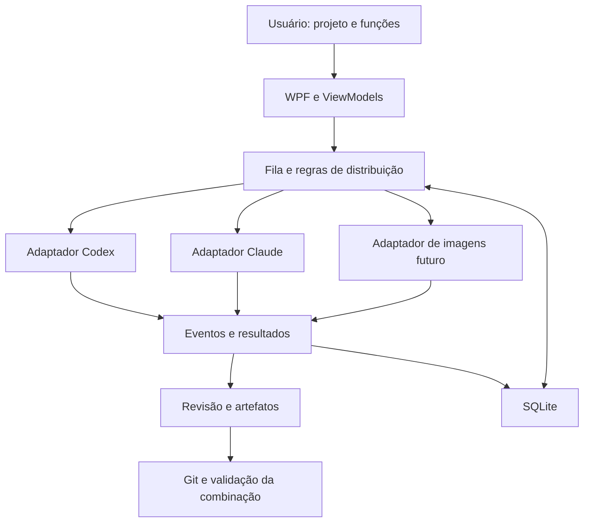

# Arquitetura do Sintonia

## Stack e organização

C# com .NET 10, interface WPF em MVVM e SQLite para o histórico real. A primeira versão é local e focada no Windows.

Estrutura atual (M0–M3, com adaptadores reais e central persistente):

```text
Sintonia.sln
src/
  Sintonia.Core/           Modelos, estados, dependências e contratos
  Sintonia.Infrastructure/ Adaptadores simulados/reais e processos
  Sintonia.Desktop/        WPF, ViewModels, navegação e composição
tests/
  Sintonia.Core.Tests/     Regras do núcleo
  Sintonia.Desktop.SmokeTests/  Fluxo real WPF com provedores simulados
  Sintonia.Infrastructure.Tests/  Detecção e ciclo de vida de processos
  Sintonia.ProcessFixture/  Processo auxiliar, sem modelos
tools/
  Sintonia.Diagnostics/   Consulta limitada de versão e ajuda
docs/
```

O Core não depende de WPF ou dos executáveis dos provedores. Infrastructure implementa contratos do Core. Desktop apresenta dados e compõe os serviços; não executa regras de negócio dentro de eventos visuais. Começar com apenas os projetos necessários ao incremento.

No M0, `SchedulingPolicy` decide admissões e valida o grafo; `TaskCoordinator` aplica reservas e transições sob uma trava curta, executando os adaptadores fora dela. Slots cancelados permanecem reservados até a tentativa parar. Snapshots e eventos entregues à UI são cópias de leitura; os ViewModels despacham atualizações para a thread WPF.

`SimulatedProviderAdapter` produz atrasos canceláveis, eventos e texto de exemplo, sem processos ou arquivos externos. `DemoScenario` fornece as quatro funções e cinco tarefas do exemplo. `ProviderSession` é um identificador demonstrativo por tentativa; retomada e compatibilidade com diretórios reais ainda não existem. A aprovação entrega ao dependente o resumo e o identificador da tentativa aprovada; disponibilidade de arquivos/revisões reais será necessária antes de escrita paralela.

O contrato `IProviderAdapter` cobre o fluxo de tarefas do M0. O chat real usa `IConversationProvider`, validado no M1. SQLite e modelos de projetos/conversas já existem; artefatos e integração Git permanecem planejados.

`IConversationProvider` já cobre conversas reais por diretório/modelo/identificador nativo, com eventos e resultado concluído/bloqueado. `ProviderProcess` limita eventos por linha, drena stderr, serializa stdin e encerra a árvore. `JsonRpcClient` correlaciona respostas e processa notificações sem bloquear a leitura. Codex verifica conta ChatGPT e política aplicada antes do turno; Claude verifica `claude.ai`/assinatura e rejeita configuração explícita de API no ambiente. Nenhum adaptador abre arquivos de credenciais. Os dois provedores podem encaminhar autorizações ao host; solicitações sem decisão explícita ou prévia suficiente são recusadas.

`ClaudeStdioSession` usa entrada/saída stream-json e inicialização do protocolo de controle antes do prompt. `can_use_tool` recebe resposta correlacionada por ID, com os mesmos parâmetros (`updatedInput`) e sem mudanças de regras (`updatedPermissions`). O host mostra o objeto completo até 64 mil caracteres; leitura, entradas ausentes/excessivas e interações especiais são recusadas. Decisões são assíncronas e não bloqueiam stdout; cancelamento do CLI, do usuário ou término inesperado retiram pedidos pendentes. Limites: 16 pedidos simultâneos, 1.024 por turno, 60 segundos para inicializar e cinco minutos por execução. Recusas locais também tornam o resultado bloqueado, mesmo se omitidas no resultado do CLI. O canal permanece aberto até o resultado terminal e as respostas em trânsito terminarem; execução autônoma em background após esse resultado continua sem suporte de acompanhamento.

`SqliteWorkspaceStore` implementa projects/conversations/runs/events/proposals/task_batches/work_tasks/function_profiles/task_worktrees/task_deliveries/task_integrations/task_integration_preparations/project_validations/task_integration_validations/project_execution_settings/run_execution_scopes com schema 10, WAL, transações e restrições de integridade. As migrações acrescentam fila, perfis, worktrees, entregas, preparação e validação da combinação sem substituir o histórico anterior. A execução assíncrona usa trabalho em background, pois Microsoft.Data.Sqlite realiza I/O síncrono. `WorkspaceChatService` reserva capacidade antes da persistência/inferência, faz checkpoints do identificador/resposta parcial, e registra resultado terminal. Reabrir reconcilia running para interrupted e preparações abandonadas para NeedsAttention sem reenvio; trava por Git comum preserva reservas/preparações/validações de executores vivos. Escrita direta no projeto é exclusiva; tarefas em checkouts distintos e validados admitem concorrência, sem liberar dependentes antes da publicação.

## Modelo de domínio

Schema 8 acrescenta `project_validations`: comandos por projeto, com revisão e cópia dos argumentos. `ValidationCommandRunner` executa `.exe` absoluto na pasta relativa, com streams limitados, prazo de até dez minutos e cancelamento da árvore. Schema 9 registra intenção/resultados de `TaskIntegrationValidationService`, que mantém a trava/reserva, confere conteúdo antes/depois de cada comando e salva a configuração/árvore exatas. `GitTaskIntegrationValidationInspector` compara entradas nativas do índice e hashes dos arquivos, sem confiar no cache de stat/assume-unchanged ou alterar o índice. Falha/timeout interrompe a sequência; conteúdo ou critérios alterados recusam sucesso. Recuperação conserva proprietário vivo e marca abandonados sem repetir comandos. Editor/execução WPF ainda pendentes; validação não publica nem libera dependentes. Contratos em [docs/PROJECT_VALIDATION.md](docs/PROJECT_VALIDATION.md).

`WorkspaceFunctionProfile` é um perfil reutilizável da biblioteca local: nome, função, provedor/modelo padrão, instruções e revisão. A biblioteca é compartilhada entre projetos na mesma instalação. Não guarda permissões nem altera configurações globais dos provedores. Nomes têm normalização Unicode/case para unicidade; revisão protege edição/exclusão concorrente. Conversas e tarefas mantêm cópias de seus parâmetros; nenhuma chave mutável liga suas instruções ao perfil. `FunctionProfile` anterior permanece no cenário demonstrativo M0.

`FunctionProfileLibraryWindow`/`FunctionProfileLibraryViewModel` apresentam criação, edição, reversão e exclusão confirmada. Alterações locais bloqueiam troca/atualização para não descartar o rascunho; fechar solicita descarte quando necessário. A central atualiza somente a biblioteca após salvar. Nova com perfil relê a revisão e preenche um novo rascunho em leitura, preservando a mensagem digitada e sessões existentes, inclusive ativas. O modelo vazio usa o padrão da instalação; disponibilidade é conferida pelo provedor ao enviar. Funções personalizadas são preservadas ao carregar conversas. A chefia usa o nome exato Chefe do projeto e reserva espaço para seu contrato no limite total de 8.000 caracteres. Fluxo em [docs/FUNCTION_PROFILES.md](docs/FUNCTION_PROFILES.md).

| Modelo | Responsabilidade |
| --- | --- |
| Project | Pasta, instruções, repositório e comandos de validação |
| Conversation | Chat do Sintonia vinculado ao projeto e a sessões nativas identificadas |
| FunctionProfile | Nome, objetivo, provedor padrão e instruções adicionais |
| WorkTask | Entrega, dependências, função, escopo e estado |
| ProviderSession | Provedor, identificador nativo, projeto e diretório compatível |
| TaskRun | Tentativa com início, término, resultado e consumo informado |
| Artifact | Arquivo, diff, imagem ou relatório produzido |
| ApprovalRequest | Ação concreta aguardando uma decisão |

Estados iniciais de tarefa: na fila, executando, em revisão, concluída, falha e cancelada. Interrupção de uma tentativa deve ser identificável. Não usar um booleano único para representar todas essas condições.

## Fluxo principal



## Integrações

O M0 mantém adaptadores simulados. `IConversationProvider` implementa início/retomada, eventos, interrupção e permissões da central real. `ProviderInstallationProbe` consulta detecção/ajuda separadamente e não declara suporte à execução real. Só declarar suporte a uma capacidade depois de verificar o comportamento real. Nem todos os provedores têm os mesmos métodos.

- Codex: App Server por stdio, contratos conferidos contra o schema instalado e autorizações por ação.
- Claude: CLI com stream-json bidirecional, session ID, retomada e host de permissões por ação. Modo plan para leitura e manual para escrita, preservando regras/hooks existentes. AskUserQuestion/ExitPlanMode ainda não têm respostas específicas no host.
- Imagens: adaptador separado, após escolha de provedor.

Usar `System.Diagnostics.Process` com argumentos separados, entrada/saída redirecionada e leitura assíncrona simultânea de stdout e stderr. Resolver wrappers do Windows sem concatenar prompts numa linha de shell. Propagar cancelamento e tratar processos filhos.

Eventos comuns podem incluir sessão iniciada, mensagem, ferramenta, pedido de permissão, consumo, resultado e erro. Preservar dados desconhecidos de forma limitada e segura; não quebrar a sessão apenas porque um provedor adicionou um campo.

## Distribuição e consistência

`ProjectExecutionSettings` permite 3–7 sessões por projeto (padrão 3), com teto global de sete no banco. Não há exclusividade por provedor. `WorkspaceExecutionPolicy` aplica vagas e conflito de pastas tanto no serviço quanto na transação SQLite. Schema 10 acrescenta configurações por projeto e escopos imutáveis por run. Escrita direta permanece exclusiva; checkouts prontos e distintos admitem trabalho paralelo. Dependências só são liberadas quando a entrega necessária foi aprovada e está disponível no diretório/revisão do dependente. Detalhes em [docs/SESSION_CONCURRENCY.md](docs/SESSION_CONCURRENCY.md).

Uma política pura de agendamento decide admissões. A reserva e a criação da tentativa precisam ser aplicadas atomicamente pelo serviço de execução. Proteção contra disparos duplicados, persistência e recuperação entram antes de execução automática prolongada.

O WPF mantém o limite salvo separado do rascunho e captura o projeto ao aplicar. `Iniciar tarefas disponíveis` relê lote/limite, seleciona uma rodada pela política compartilhada e inicia sessões nas vagas disponíveis. Jobs guardam seus escopos e tokens; cancelamento do grupo não cancela uma tarefa iniciada separadamente. A fila conserva seu projeto/contador e aguarda execução, recarga e histórico antes de liberar controles ou fechar. Rodadas posteriores e revisão permanecem explícitas.

Para sessões reutilizadas, conferir provedor, projeto, função e diretório. Conversas não compartilham memória automaticamente: entregar especificações e resumos explícitos entre sessões.

## Persistência, Git e dados

SQLite registra tentativas, estados e eventos com migrações explícitas. Reconciliar execuções interrompidas antes de repetir operações com possíveis efeitos já produzidos.

Worktrees separam alterações. O merge será serial e testado sobre a versão combinada. Uma falha de remoção de worktree não autoriza exclusão recursiva indiscriminada de seu diretório.

`TaskWorktreeService` registra a intenção antes de criar o checkout por `IGitTaskWorktreeManager`. Schema 5 vincula diretórios, branch e commit à tarefa, sem mudar o projeto lógico. Reserva atômica bloqueia preparações concorrentes no mesmo Git comum e início durante preparação; recuperação marca NeedsAttention, sem repetir Git. O manager cria fora do original, recusa colisões/links/submódulos/filtros ativos, usa a base confirmada e valida registro/branch/bloqueio/ancestralidade antes de executar. O chat passa esse vínculo para a reserva transacional, impedindo despacho obsoleto na pasta original. A sessão nativa conserva o checkout entre tentativas. Aprovação de entrega com worktree ainda bloqueia sucessores até implementar integração; escrita direta continua exclusiva por projeto. Detalhes em [docs/TASK_WORKTREES.md](docs/TASK_WORKTREES.md).

`IGitRepositoryInspector`/`GitRepositoryInspector` consultam a pasta selecionada com Git nativo, argumentos separados e o processo assíncrono/limitado já existente. Rev-parse identifica pasta de trabalho/bare/raiz; status porcelain v2 com NUL conserva nomes e renomeações literalmente, além de branch, commit, acompanhamento local e conflitos. Sem Git, sem repositório, bare, erro e resposta parcial são estados explícitos, nunca interpretados como pasta limpa. Prazo total de 20 segundos e até 64 Ki caracteres por stream. Variáveis GIT_* herdadas são retiradas somente do processo; locks opcionais/fsmonitor/untracked cache e protocolos de rede ficam desativados durante a consulta. Configurações de confiança não são alteradas. O diagnóstico é um retrato local, não uma reserva de revisão para futuras operações de escrita. Integração de worktrees continua pendente.

`GitDiagnosticsWindow`/`GitDiagnosticsViewModel` mantêm o projeto capturado ao abrir o painel, consultam ao carregar e permitem atualização/cancelamento explícitos. A lista separa índice e pasta e preserva origem de renomeações; respostas tardias após cancelamento não aparecem. Cada nova consulta retira o resultado anterior até terminar; erro/ausência de Git não exibe estado limpo. O painel cancela e aguarda ao fechar; a central cancela e aguarda consultas de suas janelas junto aos jobs dos provedores. Status não é persistido no SQLite, pois precisa ser atualizado após mudanças. Subpastas mostram a raiz e alterações do repositório inteiro. Detalhes em [docs/GIT_DIAGNOSTICS.md](docs/GIT_DIAGNOSTICS.md).

Autenticação permanece nos mecanismos suportados dos provedores. Chaves futuras de imagens ficam no armazenamento seguro do Windows, nunca na configuração versionada. Logs devem limitar conteúdo e remover dados sensíveis antes de exportação.

`TaskDiffService` lê o vínculo persistido e recusa tarefa em execução ou alterada durante a consulta. `IGitTaskDiffReader`/`GitTaskDiffReader` combinam status local e diferenças desde a base, incluindo commits posteriores, arquivos preparados/não preparados/novos, renomeações, exclusões e conflitos. Cada arquivo pode comparar base, índice ou pasta; renomeações usam a origem correspondente à comparação. Git roda com caminhos literais, sem diff externo/textconv/filtros/fsmonitor e sem alteração do índice. Consultas têm prazo total de 20 segundos e limites de saída; listas parciais são recusadas, conteúdos grandes/binários são explícitos. Validação de worktree/branch/estado precede e sucede a leitura. A consulta não fixa uma revisão imutável para integração. Detalhes em [docs/TASK_DIFFS.md](docs/TASK_DIFFS.md).

`TaskDeliveryService`/`GitTaskDeliveryInspector` registram commit/árvore da consulta revisada de uma tarefa aprovada, com worktree pronta e status limpo. Não fazem commits ou alteram refs. Comandos de worktrees/diffs/entregas usam `--no-replace-objects` para consultar os objetos originais, preservando refs de substituição existentes. Schema 6 guarda uma entrega imutável por tarefa/run, com comparação transacional contra aprovação/vínculo. A prévia de integração confere origem e destino; reserva serial por Git comum bloqueia runs/preparações relacionados, inclusive entre stores do mesmo banco. Recuperação marca atenção sem repetir operações. Reserva não libera dependentes nem representa integração realizada. Detalhes em [docs/TASK_DELIVERIES.md](docs/TASK_DELIVERIES.md).

## Interface

`TaskIntegrationPreparationService` adquire a trava nativa antes da reserva, persiste intenção e chama `GitTaskIntegrationPreparer` para combinar numa nova worktree bloqueada/destacada. Merge ort sem commit/fast-forward preserva HEAD de referência; resultado guarda árvore ou caminhos conflitantes. Término e liberação são atômicos; cancelamento/interrupção conservam pastas parciais. Não publica, executa testes do projeto ou libera dependentes. Detalhes em [docs/TASK_INTEGRATION_PREPARATION.md](docs/TASK_INTEGRATION_PREPARATION.md).

Português, com projetos, funções, tarefas, sessões e revisão. Modo demonstrativo precisa estar visível. O estado da execução pertence ao serviço, e não ao controle visual. Evitar bloquear a thread da interface com processos, banco ou Git.

Central para várias pastas de projeto, com chat, escolha de provedor/modelo e navegação de sessões. O histórico local vincula conversas ao identificador nativo, modelo, função e diretório; trocar de provedor cria outra conversa. Abrir a conversa no Sintonia é diferente de abrir/controlar uma janela do aplicativo original; esta segunda capacidade depende de interface verificada.

Essa central está implementada em `WorkspaceWindow`/`WorkspaceViewModel`, com `WorkspaceProject`, `WorkspaceConversation`, `ChatRun` e `ChatEvent`. A função e o acesso podem ser ajustados entre turnos; provedor/modelo são definidos ao criar a conversa e o modelo efetivo é preservado. Jobs vivos mantêm seus ViewModels ao navegar. Códigos de acesso, prompts e eventos nunca são transformados pelo host em comandos de shell. O host apresenta autorizações Codex/Claude via TCS assíncrono e serializa decisões no painel; fechar cancela decisões pendentes. O catálogo do provedor é consultado sob prazo. A demonstração usa `MainWindow` separadamente.

A função de chefe usa uma sessão normal do provedor para produzir uma proposta de tarefas. O aplicativo valida a proposta e aplica as regras; a chefia não ganha um caminho alternativo para alterar permissões, aprovar entregas ou integrar código. Detalhes em [docs/PRODUCT_SCOPE.md](docs/PRODUCT_SCOPE.md).

`PlanProposalFormat` valida a proposta no Core: versão 1, um único bloco sintonia-plan, até 20 tarefas com função, provedor/modelo, acesso recomendado, instruções, escopo, dependências e critérios. Reutiliza `SchedulingPolicy.ValidateGraph`; recusa campos extras/repetidos, enums desconhecidos, dependências inválidas, ciclos e escopo absoluto/com '..'/curingas. A validação é lexical, sem resolver links de diretório e sem constituir sandbox. Nenhuma proposta cria processos ou executa comandos.

`WorkspaceChatService` força leitura e retira o host de autorização quando a função é Chefe do projeto; anexa o contrato do plano somente ao pedido enviado, mantendo instruções originais na conversa. A central importa propostas de respostas concluídas; parsing/persistência de proposta não mudam o resultado já salvo do chat. Abrir revisão reconcilia respostas estruturadas concluídas ainda sem proposta, de forma idempotente, sem inferência ou perda de edições.

`WorkspaceProposal` vincula a definição ao projeto e ao run de origem. Criação lê a resposta concluída no banco e verifica o projeto; um run cria no máximo uma proposta. Edições usam comparação de revision e mantêm origem imutável. Draft/Approved representam revisão do plano; salvar ajustes como Draft retira aprovação. `ProposalReviewWindow`/`ProposalReviewViewModel` oferecem edição, validação, inclusão/remoção e confirmação, sem chamar coordenadores ou provedores. Planos aprovados ainda aguardam execução futura. Detalhes em [docs/PLAN_PROPOSALS.md](docs/PLAN_PROPOSALS.md).

Um terminal completo, editor de código ou renderização avançada de Markdown pode exigir componentes específicos. Só adicionar quando resolver uma necessidade concreta do usuário.

## Fila real de tarefas

`WorkspaceTaskBatch` guarda uma cópia imutável da revisão aprovada; um plano entra na fila uma única vez, sem inferência. A proposta encaminhada deixa de aceitar edições; alterações de planejamento exigem outra proposta. `WorkspaceTask` mantém conversa, estado, tentativas, run atual e decisão de revisão. `WorkspaceTaskPolicy` exige dependências aprovadas e limita cada tarefa a três tentativas explícitas. O último ajuste permanece no pedido após tentativas canceladas/falhas.

`WorkspaceChatService.SendTaskAsync` entrega objetivo, escopo, critérios, ajustes e trechos dos runs aprovados das dependências, sem pressupor memória compartilhada. Usa a mesma reserva do chat. `BeginRunAsync` verifica propriedade da conversa, estado, vínculo esperado de worktree e dependências e grava tentativa/reserva numa transação. `FinishRunAsync` grava resultado/eventos e estado de tarefa juntos; término concluído vira AwaitingReview. Revisão compara o run atual concluído; Approved libera dependentes quando a entrega não está pendente de integração numa worktree. Aprovações de entregas são definitivas neste incremento, sem equivaler a integração Git. Recuperação marca tarefa e run interrompidos sem reenvio.

A aba Pasta de trabalho consulta a prévia, confirma diretório/branch/base e prepara por operação independente do modelo. O workspace vincula as operações Git ao cancelamento da central; o encerramento também aguarda os painéis da fila salvarem o estado. O projeto capturado pelo painel permanece fixo ao navegar. Cancelamento não descarta efeitos e NeedsAttention oferece retomada explícita; não há remoção automática de worktrees.

`TaskQueueWindow`/`TaskQueueViewModel` permitem encaminhar planos, iniciar tentativas, acompanhar mensagens/eventos, selecionar tentativas anteriores e revisar a entrega atual. `WorkspaceViewModel` registra os jobs da fila junto aos do chat e compartilha o host de permissões, mostrado nas duas janelas; encerramento cancela e aguarda ambos. Conversas de tarefas ficam consultáveis no chat, sem envio ou edição de função/acesso. A janela de planos indica quando a proposta já foi encaminhada. A revisão de uma tentativa anterior fica desabilitada e é recusada no banco. Detalhes em [docs/TASK_QUEUE.md](docs/TASK_QUEUE.md).

`TaskDiffWindow`/`TaskDiffViewModel` capturam projeto/tarefa ao abrir por Pasta de trabalho na fila. Consultam lista ao carregar e leem o arquivo/comparação escolhido sem bloquear a interface. Operação pendente bloqueia seleção e retira a prévia anterior; atualização, erro ou cancelamento retira a lista. O serviço revalida estado persistido antes/depois; a janela descarta resultados tardios e cancela/aguarda ao fechar. A central também aguarda seus painéis de diffs. Leitura não aprova entrega nem fixa conteúdo para a futura integração.

O mesmo painel registra o commit da consulta desde a base para uma tarefa aprovada com status limpo. Confirmação mostra commit/tarefa e abrangência da árvore; depois o serviço confere objetos/estado e o banco compara a aprovação/vínculo antes de salvar. O registro aparece no cabeçalho e em Pasta de trabalho ao atualizar a fila. Recusa não chama o serviço; falha retira a consulta e orienta atualização. Registro concluído não é desfeito por cancelamento posterior. Fechamento aguarda a operação, sem disparar integração.

`Preparar combinação` usa o registro imutável, consulta o destino e confirma commits/branch/pasta antes do executor. Recusa não reserva/cria checkout; mudança posterior é revalidada. Resumo mostra estado salvo e pasta/árvore/conflitos num texto copiável com rolagem; a lista de diffs continua ligada à tarefa. Cancelamento/fechamento aguarda persistência de atenção, descarta respostas tardias e conserva arquivos parciais. Atualização/reabertura conserva o projeto/tarefa. Combinação não executa validadores, publica ou libera dependentes.
