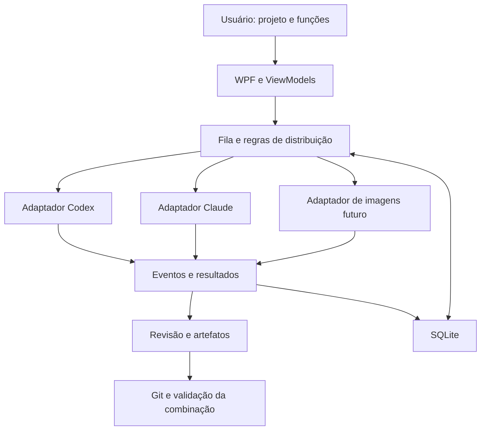

# Arquitetura do Sintonia

## Stack e organização

C# com .NET 10, interface WPF em MVVM e SQLite para o histórico real. A primeira versão é local e focada no Windows.

Estrutura atual (M0 e adaptadores reais do M1):

```text
Sintonia.sln
src/
  Sintonia.Core/           Modelos, estados, dependências e contratos
  Sintonia.Infrastructure/ Adaptadores simulados/reais e processos
  Sintonia.Desktop/        WPF, ViewModels, navegação e composição
tests/
  Sintonia.Core.Tests/     Regras do núcleo
  Sintonia.Desktop.SmokeTests/  Fluxo real WPF com provedores simulados
  Sintonia.Infrastructure.Tests/  Detecção e ciclo de vida de processos
  Sintonia.ProcessFixture/  Processo auxiliar, sem modelos
tools/
  Sintonia.Diagnostics/   Consulta limitada de versão e ajuda
docs/
```

O Core não depende de WPF ou dos executáveis dos provedores. Infrastructure implementa contratos do Core. Desktop apresenta dados e compõe os serviços; não executa regras de negócio dentro de eventos visuais. Começar com apenas os projetos necessários ao incremento.

No M0, `SchedulingPolicy` decide admissões e valida o grafo; `TaskCoordinator` aplica reservas e transições sob uma trava curta, executando os adaptadores fora dela. Slots cancelados permanecem reservados até a tentativa parar. Snapshots e eventos entregues à UI são cópias de leitura; os ViewModels despacham atualizações para a thread WPF.

`SimulatedProviderAdapter` produz atrasos canceláveis, eventos e texto de exemplo, sem processos ou arquivos externos. `DemoScenario` fornece as quatro funções e cinco tarefas do exemplo. `ProviderSession` é um identificador demonstrativo por tentativa; retomada e compatibilidade com diretórios reais ainda não existem. A aprovação entrega ao dependente o resumo e o identificador da tentativa aprovada; disponibilidade de arquivos/revisões reais será necessária antes de escrita paralela.

O contrato mínimo `IProviderAdapter` cobre a execução e eventos simulados. Detecção, permissões, eventos nativos e retomada serão acrescentados somente com evidência do M1. Os demais modelos da tabela abaixo são planejados; não há SQLite neste marco.

`IConversationProvider` já cobre conversas reais por diretório/modelo/identificador nativo, com eventos e resultado concluído/bloqueado. `ProviderProcess` limita eventos por linha, drena stderr, serializa stdin e encerra a árvore. `JsonRpcClient` correlaciona respostas e processa notificações sem bloquear a leitura. Codex verifica conta ChatGPT e política aplicada antes do turno; Claude verifica `claude.ai`/assinatura e rejeita configuração explícita de API no ambiente. Nenhum adaptador abre arquivos de credenciais. O host pode responder às autorizações do Codex; solicitações sem host são recusadas. O host Claude ainda está pendente.

`SqliteWorkspaceStore` implementa projects/conversations/runs/events com migração 1, WAL, transações e restrições de integridade. A execução assíncrona usa trabalho em background, pois Microsoft.Data.Sqlite realiza I/O síncrono. `WorkspaceChatService` reserva capacidade antes da persistência/inferência, faz checkpoints do identificador/resposta parcial, e registra resultado terminal. Reabrir reconcilia running para interrupted sem reenvio. Escrita no mesmo projeto é serial até existir integração de worktrees.

## Modelo de domínio

| Modelo | Responsabilidade |
| --- | --- |
| Project | Pasta, instruções, repositório e comandos de validação |
| Conversation | Chat do Sintonia vinculado ao projeto e a sessões nativas identificadas |
| FunctionProfile | Nome, objetivo, provedor padrão e instruções adicionais |
| WorkTask | Entrega, dependências, função, escopo e estado |
| ProviderSession | Provedor, identificador nativo, projeto e diretório compatível |
| TaskRun | Tentativa com início, término, resultado e consumo informado |
| Artifact | Arquivo, diff, imagem ou relatório produzido |
| ApprovalRequest | Ação concreta aguardando uma decisão |

Estados iniciais de tarefa: na fila, executando, em revisão, concluída, falha e cancelada. Interrupção de uma tentativa deve ser identificável. Não usar um booleano único para representar todas essas condições.

## Fluxo principal



## Integrações

A evolução planejada de `IProviderAdapter` inclui início/retomada, eventos, interrupção e permissões. No M0, só execução simulada está implementada. `ProviderInstallationProbe` consulta detecção/ajuda separadamente e não declara suporte à execução real. Só declarar suporte a uma capacidade depois de verificar o comportamento real. Nem todos os provedores têm os mesmos métodos.

- Codex: investigar App Server por stdio; gerar ou validar contratos contra a versão instalada. Considerar `exec --json` para lote quando adequado.
- Claude: investigar CLI com saída estruturada, session ID e retomada; definir host de permissões quando necessário. Um SDK por API é uma alternativa futura, com autenticação e termos próprios.
- Imagens: adaptador separado, após escolha de provedor.

Usar `System.Diagnostics.Process` com argumentos separados, entrada/saída redirecionada e leitura assíncrona simultânea de stdout e stderr. Resolver wrappers do Windows sem concatenar prompts numa linha de shell. Propagar cancelamento e tratar processos filhos.

Eventos comuns podem incluir sessão iniciada, mensagem, ferramenta, pedido de permissão, consumo, resultado e erro. Preservar dados desconhecidos de forma limitada e segura; não quebrar a sessão apenas porque um provedor adicionou um campo.

## Distribuição e consistência

Começar com duas execuções simultâneas e limites configuráveis por provedor. Dependências só são liberadas quando a entrega necessária foi aprovada e está disponível no diretório/revisão do dependente.

Uma política pura de agendamento decide admissões. A reserva e a criação da tentativa precisam ser aplicadas atomicamente pelo serviço de execução. Proteção contra disparos duplicados, persistência e recuperação entram antes de execução automática prolongada.

Para sessões reutilizadas, conferir provedor, projeto, função e diretório. Conversas não compartilham memória automaticamente: entregar especificações e resumos explícitos entre sessões.

## Persistência, Git e dados

SQLite registra tentativas, estados e eventos com migrações explícitas. Reconciliar execuções interrompidas antes de repetir operações com possíveis efeitos já produzidos.

Worktrees separam alterações. O merge é serial e testado sobre a versão combinada. Uma falha de remoção de worktree não autoriza exclusão recursiva indiscriminada de seu diretório.

Autenticação permanece nos mecanismos suportados dos provedores. Chaves futuras de imagens ficam no armazenamento seguro do Windows, nunca na configuração versionada. Logs devem limitar conteúdo e remover dados sensíveis antes de exportação.

## Interface

Português, com projetos, funções, tarefas, sessões e revisão. Modo demonstrativo precisa estar visível. O estado da execução pertence ao serviço, e não ao controle visual. Evitar bloquear a thread da interface com processos, banco ou Git.

Direção ampliada: uma central para várias pastas de projeto, com chat, escolha de provedor/modelo e navegação de sessões. Project e Conversation ainda são modelos planejados. O histórico local deve vincular conversas a ProviderSession, identificador nativo, modelo, função e diretório; trocar de provedor exige sessão compatível e contexto explícito. Abrir a conversa no Sintonia é diferente de abrir/controlar uma janela do aplicativo original; esta segunda capacidade depende de interface verificada.

A função de chefe usa uma sessão normal do provedor para produzir uma proposta de tarefas. O aplicativo valida a proposta e aplica as regras; a chefia não ganha um caminho alternativo para alterar permissões, aprovar entregas ou integrar código. Detalhes em [docs/PRODUCT_SCOPE.md](docs/PRODUCT_SCOPE.md).

Um terminal completo, editor de código ou renderização avançada de Markdown pode exigir componentes específicos. Só adicionar quando resolver uma necessidade concreta do usuário.
