# Sintonia

Aplicativo desktop para Windows, em C#/.NET, que serve como canal de comunicação e coordenação entre agentes de IA do Codex e do Claude. Organiza várias sessões nos projetos que o usuário precisar, com contexto separado por projeto; os agentes executam o trabalho com suas ferramentas.

O usuário abre projetos, escolhe uma IA/modelo e acompanha as ferramentas trabalhando. Perfis reutilizáveis guardam funções, provedor/modelo padrão e instruções para sessões normais dos provedores. A chefia produz planos editáveis; a fila permite encaminhar, iniciar tarefas, revisar entregas e preparar seus resultados no chat para atualizar o plano. Entregas Git são combinadas, validadas e publicadas localmente mediante confirmação. Jogos são apenas um exemplo opcional de uso.

## Objetivos

- Conectar sessões do Codex e do Claude para trabalharem em conjunto em múltiplos projetos.
- Encaminhar instruções, contexto e resultados entre sessões e acompanhar suas entregas.
- Preservar as skills, os plugins e as conexões MCP compatíveis com seus CLIs.
- Abrir ou retomar sessões conforme o trabalho for liberado.
- Separar alterações paralelas com Git e revisar entregas antes da integração.
- Entregar um aplicativo utilizável e um projeto demonstrável em portfólio .NET.

A produção de código, documentos, imagens e outros arquivos pertence aos agentes e às ferramentas disponíveis em suas instalações. O Sintonia organiza a comunicação e o fluxo geral de entregas. Em 09/10/2026, o usuário retirou o marco de artes e biblioteca de assets por duplicar essas responsabilidades; a justificativa está na decisão 011 de [docs/DECISIONS.md](docs/DECISIONS.md).

## Stack escolhida

C# · .NET 10 · WPF · MVVM · SQLite · testes automatizados.

A comunicação real usa Codex App Server por stdio e Claude Code com stream-json. O login por assinatura dos CLIs é conferido antes dos turnos; não há configuração de API keys nem fallback automático de cobrança.

## Estado atual

**M2 concluído; M3 com publicação Git validada e M4 com revisão assistida do plano.** Cadastre projetos, escolha Codex/Claude e modelo, converse e retome sessões. Histórico, perfis, tarefas e entregas sobrevivem à reabertura. Prepare worktrees, revise diffs, registre commits, combine em pasta separada e execute critérios de validação configuráveis. Uma combinação Passed vigente pode ser publicada localmente; dependentes exigem a revisão integrada na sua pasta. A chefia recebe resultados no chat e propõe ajustes para tarefas ainda não iniciadas, com revisão/confirmação. Limites por projeto: 3–7 sessões, 1–3 tentativas por tarefa e 1–300s por execução; teto global de sete sessões. Escrita paralela usa worktrees validadas distintas. Limpeza assistida e quota restante/limites agregados de consumo continuam pendentes. [Sessões](docs/SESSION_CONCURRENCY.md), [publicação](docs/TASK_PUBLICATION.md) e [chefia/limites](docs/PLAN_UPDATES.md).

Build sem avisos/erros, 270 testes xUnit verificados e fluxos WPF de sete sessões, validação/publicação e revisão do plano aprovados sem erros de binding. A verificação geral passou em 269 casos; uma expectativa antiga de schema futuro foi corrigida e o caso passou novamente em Debug/Release. [Evidências](docs/DEVELOPMENT_LOG.md). Testes de Git usam repositórios reais e processos/runs simulados; nenhum modelo foi chamado nestes incrementos.

Ambos os provedores leram uma amostra e responderam corretamente dentro da janela real, usando assinaturas. Retomada e interrupção também foram verificadas. Codex e Claude têm autorização por ação na central, preservando regras/hooks existentes. No Claude, uma prova real recusou a criação de um arquivo e autorizou outra na mesma sessão, conferindo o conteúdo. A função **Chefe do projeto** gera propostas estruturadas em leitura. **Revisar planos** permite editar e confirmar; **Fila de tarefas** encaminha o plano, inicia tentativas e registra aprovação ou ajustes das entregas. As provas reais foram finitas; os testes novos usam provedores simulados.

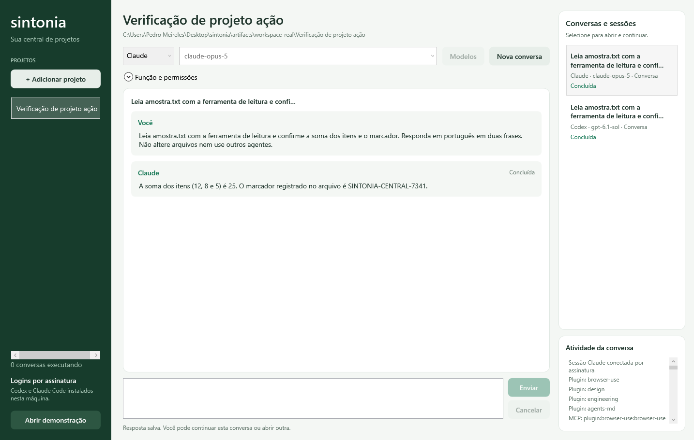

O botão **Abrir demonstração** abre o M0, com fila/revisão inteiramente simuladas e identificadas; seus exemplos continuam somente em memória.

A demonstração Electron criada durante a pesquisa foi um experimento de fluxo; ela não é a implementação deste repositório. O produto será desenvolvido em C#/.NET.

## Documentação

- [CONTEXT.md](CONTEXT.md): decisões, requisitos e ponto de retomada.
- [ROADMAP.md](ROADMAP.md): marcos e critérios de aceite.
- [ARCHITECTURE.md](ARCHITECTURE.md): estrutura proposta e contratos.
- [CONTRIBUTING.md](CONTRIBUTING.md): ambiente, validação e commits.
- [AGENTS.md](AGENTS.md): instruções para assistentes de programação.
- [CLAUDE.md](CLAUDE.md): entrada de contexto para Claude Code.
- [Registro de desenvolvimento](docs/DEVELOPMENT_LOG.md).
- [Perfis de função](docs/FUNCTION_PROFILES.md).
- [Diagnóstico Git](docs/GIT_DIAGNOSTICS.md).
- [Worktrees por tarefa](docs/TASK_WORKTREES.md).
- [Revisão de diffs](docs/TASK_DIFFS.md).
- [Registro de entregas e reserva de integração](docs/TASK_DELIVERIES.md).
- [Preparação da combinação em pasta separada](docs/TASK_INTEGRATION_PREPARATION.md).
- [Validação configurável por projeto](docs/PROJECT_VALIDATION.md).
- [Publicação Git e revisão integrada](docs/TASK_PUBLICATION.md).
- [Acompanhamento da chefia, revisão do plano e limites](docs/PLAN_UPDATES.md).
- [Análise do Maestro](docs/MAESTRO_ANALYSIS.md).
- [Decisões técnicas](docs/DECISIONS.md).

## Executar

Requisitos: Windows e SDK do .NET 10. O repositório fixa a linha 10.0.200 do SDK; aceita atualizações de patch.

```powershell
rtk proxy dotnet restore Sintonia.sln --locked-mode
rtk proxy dotnet build Sintonia.sln --no-restore
rtk proxy dotnet test Sintonia.sln --no-build
rtk proxy dotnet run --project src/Sintonia.Desktop --no-build
```

O aplicativo não depende do RTK. Em outro ambiente, os comandos podem começar diretamente com `dotnet`.

Na central, clique em **Adicionar projeto**, escolha a pasta, IA e modelo e envie um pedido. **Nova conversa** permite escolher outra IA/modelo; a lista à direita abre o histórico e retoma a sessão ao enviar novamente. **Função e permissões** configura instruções e acesso de leitura/escrita. Quando Codex ou Claude pedirem autorização, confira a pasta e a prévia e escolha **Permitir esta ação** ou **Recusar**. As regras e os hooks dos provedores também podem permitir ou recusar ferramentas. **Cancelar** interrompe a conversa selecionada e suas decisões pendentes.

O host Claude aprova somente os parâmetros exibidos, sem criar regras permanentes. Em leitura, solicitações ao host são recusadas. Prévias incompletas ou acima de 64 mil caracteres e interações que exigem respostas especiais (`AskUserQuestion`/`ExitPlanMode`) também são recusadas. O fluxo atual cobre um turno até seu resultado terminal; trabalho autônomo em background após esse resultado ainda não tem acompanhamento.

O histórico fica em `%LOCALAPPDATA%/Sintonia/workspace.db`. Execuções sem resultado terminal são marcadas como interrompidas ao reabrir; nenhum pedido é reenviado automaticamente.

Abra **Perfis de função** para salvar configurações de análise, documentação, desenvolvimento ou outras funções. Na central, escolha o perfil em **Função e permissões** e use **Nova com perfil**. A ação preenche uma nova conversa em leitura, conserva a mensagem em rascunho e permite conferir os padrões antes de enviar. Salvar/aplicar não chama um modelo; editar ou excluir preserva conversas e tarefas já criadas. Modelo vazio usa o padrão da instalação. [Fluxo, edição e limites dos perfis](docs/FUNCTION_PROFILES.md).

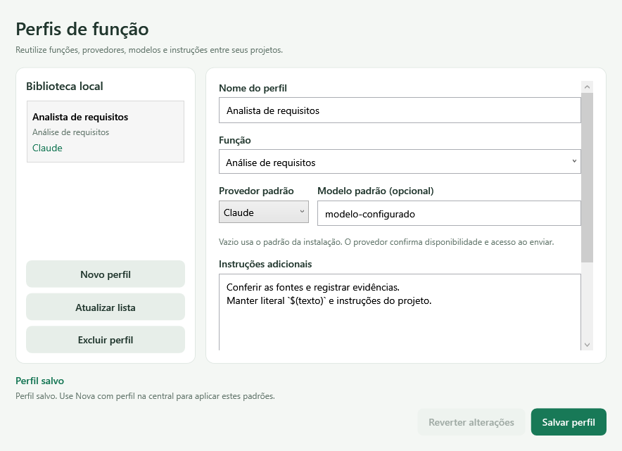

Para planejar, selecione **Chefe do projeto** em **Função e permissões** e descreva o objetivo no chat. A chefia usa leitura e mantém a IA/modelo escolhido. Ao receber uma proposta válida, abra **Revisar planos**. Ajuste responsável, modelo, função, acesso recomendado, instruções, escopo, dependências e critérios; adicione ou remova tarefas conforme necessário. **Confirmar plano** registra sua aprovação para execução futura. Salvar ajustes como rascunho retira a aprovação anterior. O acesso recomendado de uma tarefa ainda depende das permissões do provedor quando houver execução.

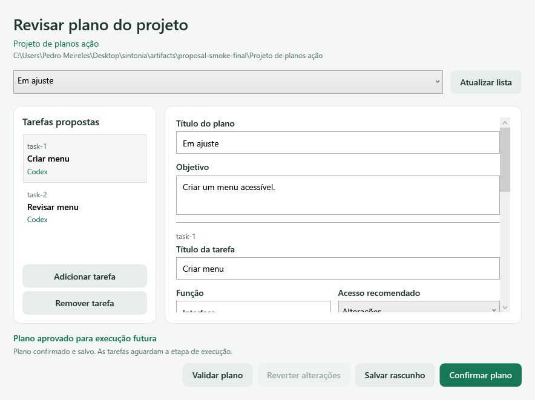

O [formato de propostas e seus limites](docs/PLAN_PROPOSALS.md) descreve validação e histórico. Propostas inválidas não viram tarefas; a resposta original do chat permanece disponível. Planos são separados por projeto e edições simultâneas não sobrescrevem revisões mais novas.

Abra **Fila de tarefas**, escolha um plano aprovado e use **Encaminhar à fila**. Essa ação preserva a revisão e cria as tarefas, sem executar modelos. Em **Função, permissões e sessões**, escolha sessões (3–7), tentativas por tarefa (1–3) e tempo por execução (1–300s), e use **Aplicar limites**. Selecione uma tarefa e use **Iniciar tentativa**, ou **Iniciar tarefas disponíveis** para distribuir uma rodada nas vagas livres. Confira resposta, arquivos e critérios; **Aprovar entrega** registra sua decisão e **Solicitar ajustes** permite outra tentativa na mesma sessão. Dependências exigem aprovação e, quando a entrega usa worktree, publicação Git registrada. Autorizações aparecem no próprio painel. Cancelar não desfaz arquivos já alterados; confira o projeto antes de retomar.

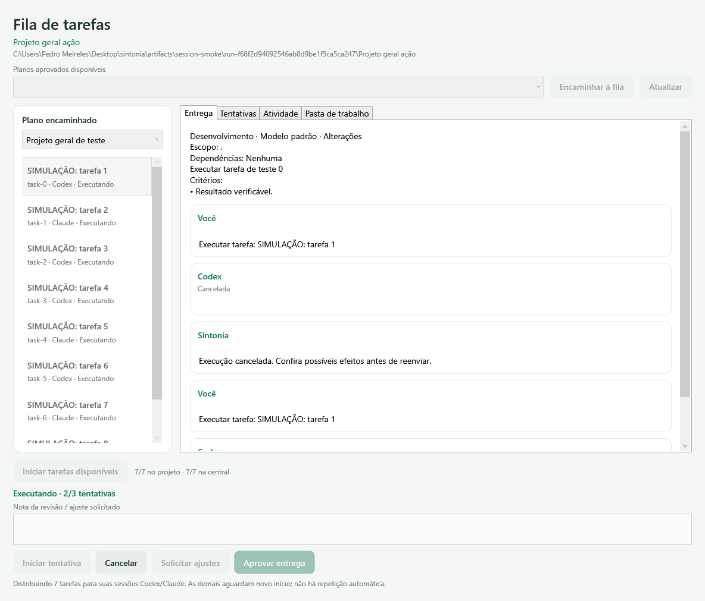

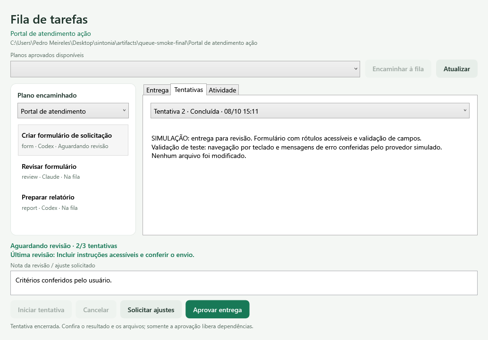

Cada tarefa respeita o limite salvo de tentativas explícitas. **Chefia e plano** prepara estado/resultados/revisões/commits no chat da chefia. Revise e envie; confirme a nova proposta em **Revisar planos** e use **Conferir e atualizar este plano** na fila. Apenas tarefas ainda não iniciadas e sem worktree podem mudar; sessões/resultados/histórico ficam preservados. [Acompanhamento](docs/PLAN_UPDATES.md) e [fila](docs/TASK_QUEUE.md). A prova real finita da fila fez um turno de leitura por provedor e conferiu contexto/reabertura; escrita e permissões visuais têm testes simulados e provas separadas dos adaptadores.

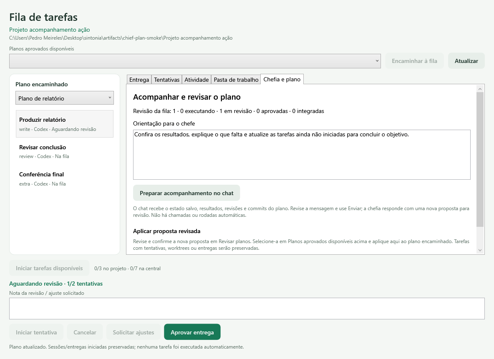

Na fila, abra **Pasta de trabalho** e use **Preparar worktree** antes da primeira tentativa de uma tarefa com escrita. Confira diretório, branch e commit na confirmação. A nova pasta vem desse commit; alterações locais e arquivos ignorados permanecem no original. Confira instruções, configurações e dependências disponíveis antes de iniciar. Preparação não chama modelos; tentativas e ajustes conservam a mesma pasta/sessão. Cancelamento/interrupção preserva efeitos para conferência e retomada explícita. Aprovação em worktree exige publicação registrada para liberar dependentes. [Fluxo e limites das worktrees](docs/TASK_WORKTREES.md).

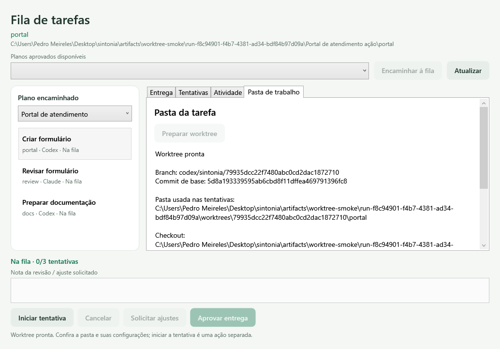

Com a tarefa parada e a worktree pronta, use **Revisar diffs** na aba **Pasta de trabalho**. Selecione arquivo e comparação desde a base, no índice ou na pasta. A lista preserva renomeações, exclusões, arquivos novos e conflitos; binários/grandes têm indicação própria. **Atualizar diffs** renova a lista, **Ler novamente** repete a comparação e **Cancelar operação** interrompe a leitura. A janela conserva projeto/tarefa ao navegar e inclui todo o checkout. Consultar não aprova nem integra a entrega; mudanças posteriores exigem nova leitura. [Fluxo e limites da revisão](docs/TASK_DIFFS.md).

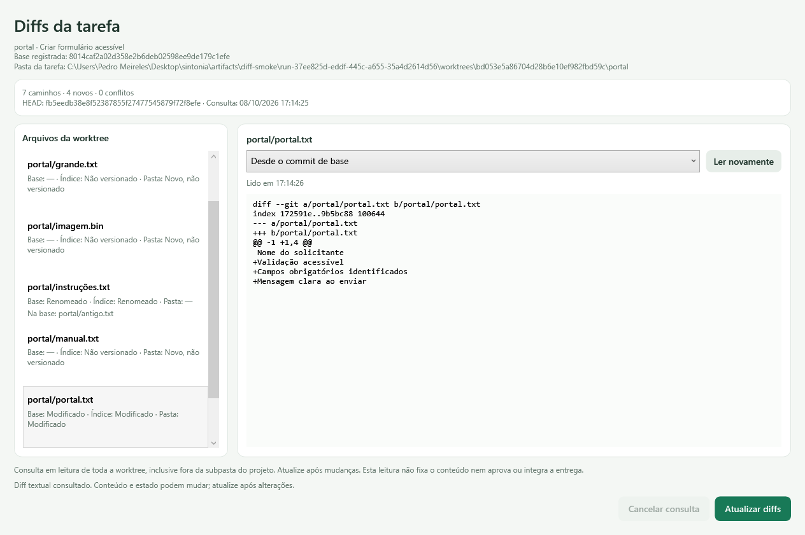

Após **Aprovar entrega**, salve suas mudanças em um commit na worktree por uma ferramenta Git de sua escolha. Atualize os diffs, confira a comparação **Desde o commit de base** e use **Registrar commit revisado**. Confirme o commit/tarefa indicado. O registro guarda o conteúdo identificado e a tentativa aprovada; a janela mostra commit, horário e integração pendente. Mudanças ainda sem commit impedem o registro. Atualizar a fila mostra esse commit em **Pasta de trabalho**. Registrar não faz merge nem libera dependentes. [Fluxo e limites do registro](docs/TASK_DELIVERIES.md).

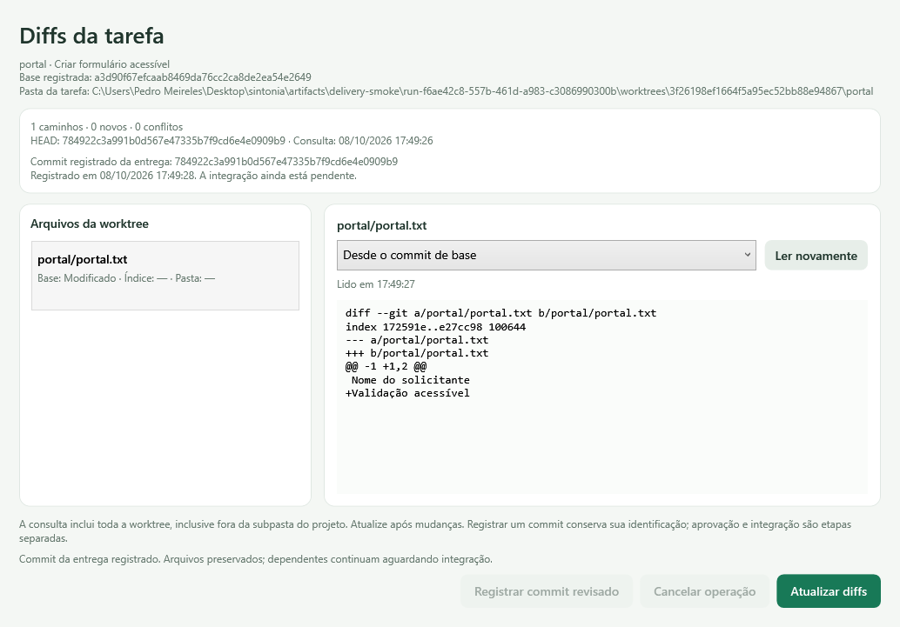

Com o commit registrado e a origem limpa, use **Preparar combinação**. Confira commits, branch e pasta original. Uma nova worktree guarda o merge e mostra árvore ou conflitos; preparar conserva o original. Configure comandos em **Critérios de validação** na central. **Validar combinação** confirma comandos/pasta/árvore e mostra histórico/logs. Uma validação Passed vigente permite **Publicar no projeto**, mediante confirmação e nova conferência. Publicação avança a branch local com a árvore validada, registra o commit e libera dependentes compatíveis; não faz push. Falhas/interrupções preservam evidências e exigem conferência. [Preparação](docs/TASK_INTEGRATION_PREPARATION.md), [validação](docs/PROJECT_VALIDATION.md) e [publicação](docs/TASK_PUBLICATION.md).

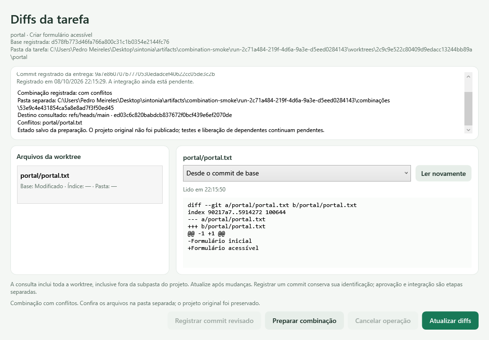

Abra **Diagnóstico Git** para conferir raiz, branch/commit, acompanhamento local e alterações preparadas, na pasta, novas ou em conflito. Uma subpasta mostra o repositório inteiro; confira a raiz indicada. O painel permite atualizar/cancelar sem modificar arquivos ou índice e mantém o projeto consultado mesmo ao navegar na central. Projetos sem Git continuam disponíveis. [Fluxo e limites do diagnóstico](docs/GIT_DIAGNOSTICS.md).

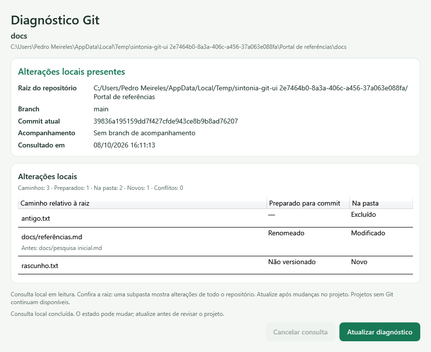

Verificação da janela real no Windows (abre, percorre o fluxo e fecha a janela de teste):

```powershell
rtk proxy dotnet run --project tests/Sintonia.Desktop.SmokeTests --no-build
rtk proxy dotnet run --project tests/Sintonia.Desktop.SmokeTests --no-build -- --workspace
rtk proxy dotnet run --project tests/Sintonia.Desktop.SmokeTests --no-build -- --proposals
rtk proxy dotnet run --project tests/Sintonia.Desktop.SmokeTests --no-build -- --sessions
rtk proxy dotnet run --project tests/Sintonia.Desktop.SmokeTests --no-build -- --queue
rtk proxy dotnet run --project tests/Sintonia.Desktop.SmokeTests --no-build -- --profiles
rtk proxy dotnet run --project tests/Sintonia.Desktop.SmokeTests --no-build -- --git
rtk proxy dotnet run --project tests/Sintonia.Desktop.SmokeTests --no-build -- --worktrees
rtk proxy dotnet run --project tests/Sintonia.Desktop.SmokeTests --no-build -- --diffs
rtk proxy dotnet run --project tests/Sintonia.Desktop.SmokeTests --no-build -- --deliveries
rtk proxy dotnet run --project tests/Sintonia.Desktop.SmokeTests --no-build -- --combinations
rtk proxy dotnet run --project tests/Sintonia.Desktop.SmokeTests --no-build -- --validation
rtk proxy dotnet run --project tests/Sintonia.Desktop.SmokeTests --no-build -- --publication
rtk proxy dotnet run --project tests/Sintonia.Desktop.SmokeTests --no-build -- --chief-plan
```

O primeiro teste percorre a demonstração; os demais verificam a central, os planos, a fila e os perfis com provedores de teste, sem consumir modelos. `--git`, `--worktrees`, `--diffs` e `--deliveries` usam Git real em pastas exclusivas de teste, com provedores/erros/interrupções/runs simulados e nenhuma chamada de modelos. Capturas em `artifacts/ui-smoke`, `artifacts/workspace-smoke`, `artifacts/proposal-smoke`, `artifacts/queue-smoke`, `artifacts/profile-smoke`, `artifacts/git-smoke`, `artifacts/worktree-smoke`, `artifacts/diff-smoke` e `artifacts/delivery-smoke`. O script `tests/Sintonia.Desktop.SmokeTests/verify-startup.ps1` confere abertura/encerramento do executável normal. A opção `--workspace-real` é prova manual finita, consome quota e não deve rodar em CI/loop.

O diagnóstico inicial de instalações já pode ser executado, separado da janela:

```powershell
rtk proxy dotnet run --project tools/Sintonia.Diagnostics --no-build
```

Consulta somente versão/ajuda, com prazos e saída limitada. Encontrar um executável não confirma autenticação, assinatura, quota disponível ou integração real. Consulte [as verificações e limites do M1](docs/PROVIDER_PROBES.md).

A prova opcional `rtk proxy dotnet run --project tools/Sintonia.Diagnostics --no-build -- permissions Claude` consome quota da assinatura: faz no máximo dois turnos em pasta exclusiva de `artifacts/provider-probes`, recusa uma escrita e permite outra com caminho/conteúdo conferidos. Não deve rodar em CI/loop.

A prova opcional `rtk proxy dotnet run --project tools/Sintonia.Diagnostics --no-build -- plan Claude` faz um turno de planejamento em leitura e valida duas tarefas, ambos os provedores e uma dependência. Consome quota; fora de CI/loop. A mesma opção aceita Codex, cuja geração real de plano ainda não foi exercitada neste incremento.

A prova opcional `rtk proxy dotnet run --project tools/Sintonia.Diagnostics --no-build -- queue` faz no máximo dois turnos reais em leitura, um por provedor, com plano fornecido pelo diagnóstico em pasta exclusiva. Verifica resposta, revisão, contexto de dependência e reabertura SQLite; para na primeira falha, sem novas tentativas. Consome quota e não deve rodar em CI/loop.

## Referência e autoria

O [Maestro](https://github.com/RunMaestro/Maestro) foi estudado como referência arquitetural. A implementação do Sintonia será independente; nenhum código do Maestro foi incorporado. A licença de distribuição do Sintonia será definida antes da primeira publicação de release.
